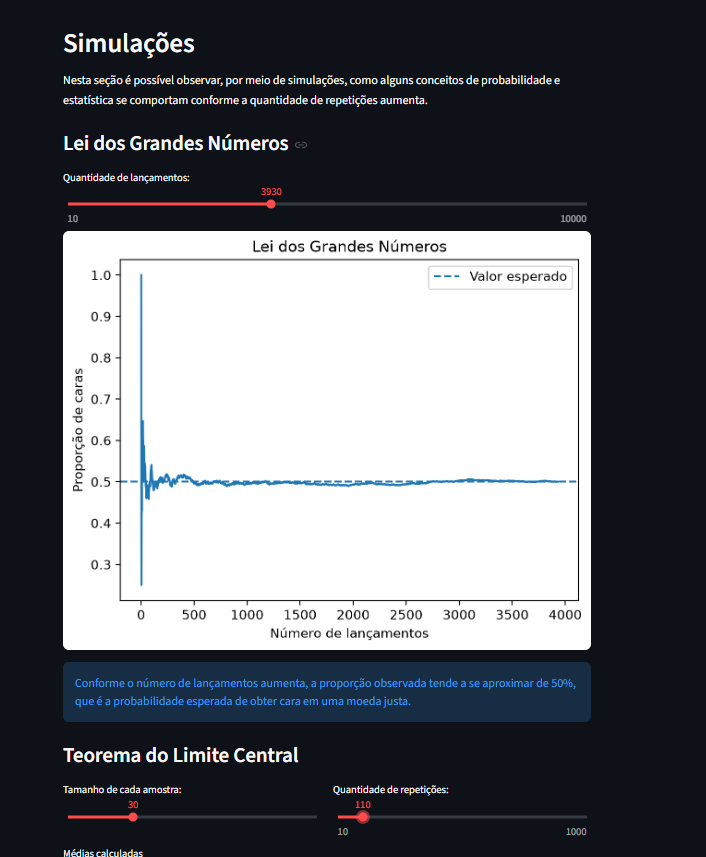

**LABORATÓRIO ESTATÍSTICO INTERATIVO**

Um projeto desenvolvido em Python para explorar estatística usando dados reais de acidentes rodoviários fatais na Austrália.

**SOBRE O PROJETO:**

A aplicação foi feita com Streamlit e reúne diferentes análises estatísticas em um só lugar.

É possível explorar os dados, calcular estatísticas, fazer simulações e observar relações entre variáveis de uma forma mais interativa.

O projeto foi desenvolvido como atividade acadêmica de estatística e programação.

**O QUE TEM NA APLICAÇÃO:**

Visão geral;

Apresentação do dataset e das principais informações utilizadas no projeto.

Estatística descritiva;

Cálculo de média, mediana, moda, amplitude, variância, desvio padrão, quartis, coeficiente de variação e outras medidas.

Também é possível visualizar tabelas de frequência, histogramas, boxplots e identificar possíveis outliers.

Simulações;

Simulações relacionadas à Lei dos Grandes Números e ao Teorema Central do Limite.

Os parâmetros das simulações podem ser alterados diretamente na aplicação.

Distribuições;

Comparação dos dados com distribuições teóricas.

Foram implementadas as distribuições Normal e Poisson, incluindo uma análise da diferença entre o comportamento observado e o esperado pelo modelo.

Correlação e regressão;

Análise da relação entre duas variáveis numéricas usando correlação de Pearson e regressão linear.

A aplicação mostra a equação da reta, o R² e permite realizar previsões a partir de um valor informado.

Descobertas;

Área destinada às principais observações encontradas durante a análise do dataset.

CAPTURA DA APLICAÇÃO:

**DATASET:**

Foi utilizado o dataset Australian Fatal Road Accident 1989–2021, disponível publicamente no Kaggle.

O arquivo utilizado na aplicação é Crash\_Data.csv.

O dataset possui 52.843 registros e informações sobre acidentes rodoviários fatais ocorridos na Austrália entre 1989 e 2021.

Entre as variáveis utilizadas estão idade, limite de velocidade, mês, ano, estado, gênero, tipo de acidente e usuário da via.

**TECNOLOGIAS:**

Python, Streamlit, Pandas, NumPy, SciPy, Matplotlib, Pytest.

**ESTRUTURA DO PROJETO:**

app.py;

Arquivo principal da aplicação Streamlit.

minhastats.py;

Funções estatísticas desenvolvidas no próprio projeto.

dados.py;

Carregamento e preparação dos dados.

simulacoes.py;

Funções utilizadas nas simulações.

distribuicoes.py;

Funções das distribuições de probabilidade.

tests;

Testes automatizados das funções desenvolvidas.

data;

Dataset utilizado na aplicação.

**COMO EXECUTAR:**

Clone o repositório e entre na pasta do projeto.

Crie e ative um ambiente virtual.

Instale as dependências do arquivo requirements.txt.

Depois, execute:

streamlit run app.py

Para executar os testes:

pytest

**TESTES:**

As funções estatísticas próprias foram comparadas com resultados obtidos por NumPy e SciPy.

Também foram criados testes para as simulações e distribuições de probabilidade.

O projeto possui 30 testes automatizados aprovados.

**REPOSITÓRIO:**

Projeto desenvolvido para uma atividade acadêmica de estatística aplicada e programação.

